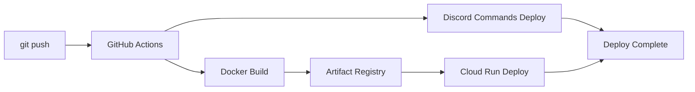

# SVML Discord Bot インフラ運用ガイド

> 最終更新: 2025年8月6日

## 📋 目次

1. [GitHub Actions CI/CD](#github-actions-cicd)
2. [Google Cloud Run](#google-cloud-run)
3. [Docker デプロイメント](#docker-デプロイメント)
4. [Artifact Registry](#artifact-registry)
5. [環境設定](#環境設定)
6. [モニタリング](#モニタリング)
7. [トラブルシューティング](#トラブルシューティング)

---

## GitHub Actions CI/CD

### 自動デプロイメントフロー



### ワークフロー構成

#### `.github/workflows/deploy.yml`
```yaml
name: Deploy to Cloud Run

on:
  push:
    branches: [ main ]
  workflow_dispatch:

env:
  PROJECT_ID: star-discord
  GAR_LOCATION: asia-northeast1
  SERVICE: svml-zimu-bot
  REGION: asia-northeast1

jobs:
  deploy:
    permissions:
      contents: read
      id-token: write

    runs-on: ubuntu-latest
    steps:
      - name: Checkout
        uses: actions/checkout@v4

      - name: Google Auth
        id: auth
        uses: 'google-github-actions/auth@v2'
        with:
          token_format: 'access_token'
          workload_identity_provider: '${{ secrets.WIF_PROVIDER }}'
          service_account: '${{ secrets.WIF_SERVICE_ACCOUNT }}'

      - name: Docker Auth
        id: docker-auth
        uses: 'docker/login-action@v3'
        with:
          registry: '${{ env.GAR_LOCATION }}-docker.pkg.dev'
          username: 'oauth2accesstoken'
          password: '${{ steps.auth.outputs.access_token }}'

      - name: Build and Push Container
        run: |-
          docker build -t "${{ env.GAR_LOCATION }}-docker.pkg.dev/${{ env.PROJECT_ID }}/${{ env.SERVICE }}/${{ env.SERVICE }}:${{ github.sha }}" ./
          docker push "${{ env.GAR_LOCATION }}-docker.pkg.dev/${{ env.PROJECT_ID }}/${{ env.SERVICE }}/${{ env.SERVICE }}:${{ github.sha }}"

      - name: Deploy to Cloud Run
        id: deploy
        uses: google-github-actions/deploy-cloudrun@v2
        with:
          service: ${{ env.SERVICE }}
          region: ${{ env.REGION }}
          image: ${{ env.GAR_LOCATION }}-docker.pkg.dev/${{ env.PROJECT_ID }}/${{ env.SERVICE }}/${{ env.SERVICE }}:${{ github.sha }}

      - name: Show Output
        run: echo ${{ steps.deploy.outputs.url }}
```

### Discord Commands Deploy

#### 特徴
- 5分間タイムアウト保護
- Discord API レート制限対応
- GitHub Actions 環境検出
- 詳細エラーログ

#### 実装 (`events/devcmd.js`)
```javascript
const logger = require('@root/common/logger');
const { REST, Routes } = require('discord.js');

async function deployCommands() {
  const timeout = 5 * 60 * 1000; // 5分

  try {
    const result = await Promise.race([
      deployCommandsCore(),
      new Promise((_, reject) =>
        setTimeout(() => reject(new Error('コマンドデプロイがタイムアウトしました (5分)')), timeout)
      )
    ]);

    logger.info('Discord スラッシュコマンドのデプロイが完了しました');
    return result;
  } catch (error) {
    logger.error('コマンドデプロイエラー:', error);
    
    if (process.env.GITHUB_ACTIONS) {
      logger.error('GitHub Actions環境でのコマンドデプロイエラー検出');
      // process.exit(1) は使用しない
    }
    
    throw error;
  }
}
```

---

## Google Cloud Run

### サービス設定

#### 基本構成
```bash
# プロジェクト設定
PROJECT_ID=star-discord
REGION=asia-northeast1
SERVICE_NAME=svml-zimu-bot

# リソース設定
CPU=1
MEMORY=512Mi
MAX_INSTANCES=10
CONCURRENCY=80
```

#### 環境変数
```bash
# 必須環境変数
DISCORD_TOKEN=your_discord_token
CLIENT_ID=your_client_id
GUILD_ID=your_guild_id

# Google Cloud 設定
GOOGLE_APPLICATION_CREDENTIALS=/app/data/svml_key.json
```

### デプロイメントコマンド

#### 手動デプロイ
```bash
# 1. Docker イメージビルド
docker build -t asia-northeast1-docker.pkg.dev/star-discord/svml-zimu-bot/svml-zimu-bot .

# 2. イメージプッシュ
docker push asia-northeast1-docker.pkg.dev/star-discord/svml-zimu-bot/svml-zimu-bot

# 3. Cloud Run デプロイ
gcloud run deploy svml-zimu-bot \
  --image=asia-northeast1-docker.pkg.dev/star-discord/svml-zimu-bot/svml-zimu-bot \
  --region=asia-northeast1 \
  --platform=managed \
  --allow-unauthenticated \
  --set-env-vars="DISCORD_TOKEN=$DISCORD_TOKEN,CLIENT_ID=$CLIENT_ID,GUILD_ID=$GUILD_ID" \
  --memory=512Mi \
  --cpu=1 \
  --max-instances=10 \
  --concurrency=80
```

#### ヘルスチェック
```javascript
// healthcheck.js
const express = require('express');
const app = express();

app.get('/', (req, res) => {
  res.status(200).send('OK');
});

app.get('/health', (req, res) => {
  res.status(200).json({
    status: 'healthy',
    timestamp: new Date().toISOString(),
    uptime: process.uptime()
  });
});

const PORT = process.env.PORT || 8080;
app.listen(PORT, () => {
  console.log(`Health check server running on port ${PORT}`);
});
```

---

## Docker デプロイメント

### Dockerfile
```dockerfile
FROM node:20-alpine

# 作業ディレクトリの設定
WORKDIR /app

# パッケージファイルのコピー
COPY package*.json ./

# 依存関係のインストール
RUN npm ci --only=production && npm cache clean --force

# アプリケーションファイルのコピー
COPY . .

# ヘルスチェック
HEALTHCHECK --interval=30s --timeout=10s --start-period=5s --retries=3 \
  CMD node healthcheck.js || exit 1

# ポート公開
EXPOSE 8080

# 非rootユーザーで実行
USER node

# アプリケーション起動
CMD ["node", "index.js"]
```

### Docker Compose (ローカル開発用)
```yaml
version: '3.8'

services:
  bot:
    build: .
    ports:
      - "8080:8080"
    environment:
      - DISCORD_TOKEN=${DISCORD_TOKEN}
      - CLIENT_ID=${CLIENT_ID}
      - GUILD_ID=${GUILD_ID}
      - NODE_ENV=development
    volumes:
      - ./data:/app/data
      - ./logs:/app/logs
    restart: unless-stopped
```

---

## Artifact Registry

### レポジトリ設定

#### 作成コマンド
```bash
# Artifact Registry レポジトリ作成
gcloud artifacts repositories create svml-zimu-bot \
  --repository-format=docker \
  --location=asia-northeast1 \
  --description="SVML Discord Bot Docker images"
```

#### 認証設定
```bash
# Docker認証設定
gcloud auth configure-docker asia-northeast1-docker.pkg.dev
```

### イメージ管理

#### タグ戦略
```bash
# 本番用: git commit hash
asia-northeast1-docker.pkg.dev/star-discord/svml-zimu-bot/svml-zimu-bot:${GITHUB_SHA}

# 開発用: ブランチ名
asia-northeast1-docker.pkg.dev/star-discord/svml-zimu-bot/svml-zimu-bot:feature-branch

# 最新: latest tag
asia-northeast1-docker.pkg.dev/star-discord/svml-zimu-bot/svml-zimu-bot:latest
```

#### クリーンアップ
```bash
# 古いイメージの削除（30日以上）
gcloud artifacts docker images list \
  asia-northeast1-docker.pkg.dev/star-discord/svml-zimu-bot/svml-zimu-bot \
  --filter="CREATE_TIME<$(date -d '30 days ago' --iso-8601)" \
  --format="value(IMAGE)" | \
  xargs -I {} gcloud artifacts docker images delete {} --quiet
```

---

## 環境設定

### ローカル開発環境

#### 必要なツール
```bash
# Node.js (v20以上)
node --version

# Docker
docker --version

# Google Cloud CLI
gcloud --version

# Git
git --version
```

#### 環境変数設定
```bash
# .env ファイル作成
cat > .env << EOF
DISCORD_TOKEN=your_discord_token
CLIENT_ID=your_client_id
GUILD_ID=your_guild_id
NODE_ENV=development
EOF
```

### 本番環境

#### Cloud Run 環境変数
```bash
# 環境変数設定
gcloud run services update svml-zimu-bot \
  --region=asia-northeast1 \
  --set-env-vars="DISCORD_TOKEN=$DISCORD_TOKEN,CLIENT_ID=$CLIENT_ID,GUILD_ID=$GUILD_ID"
```

#### Secrets Manager
```bash
# シークレット作成
gcloud secrets create discord-token --data-file=token.txt

# Cloud Run にシークレット設定
gcloud run services update svml-zimu-bot \
  --region=asia-northeast1 \
  --set-secrets="DISCORD_TOKEN=discord-token:latest"
```

---

## モニタリング

### ログ監視

#### Cloud Logging
```bash
# ログ確認
gcloud logs read "resource.type=cloud_run_revision AND resource.labels.service_name=svml-zimu-bot" \
  --limit=50 \
  --format="table(timestamp,severity,textPayload)"
```

#### ログレベル
- `ERROR` - システムエラー、即座に対応が必要
- `WARN` - 警告、監視が必要
- `INFO` - 一般的な情報
- `DEBUG` - デバッグ情報（本番では無効）

### パフォーマンス監視

#### メトリクス
- CPU使用率
- メモリ使用率
- リクエスト数
- レスポンス時間
- エラー率

#### アラート設定
```bash
# CPU使用率アラート
gcloud alpha monitoring policies create \
  --policy-from-file=cpu-alert-policy.yaml
```

---

## トラブルシューティング

### よくある問題と解決方法

#### 1. GitHub Actions タイムアウト
```
問題: デプロイが6分以上で停止
解決: Promise.race によるタイムアウト制御実装済み
確認: GitHub Actions ログの確認
```

#### 2. Discord API エラー
```
問題: コマンド登録失敗
原因: レート制限、権限不足
解決: 
- Discord API エラーコード確認
- TOKEN、CLIENT_ID の確認
- Bot 権限の確認
```

#### 3. Cloud Run デプロイエラー
```
問題: サービス起動失敗
確認: 
- Cloud Run ログの確認
- 環境変数の確認
- Dockerfile の確認
解決:
- リソース制限の調整
- ヘルスチェックの確認
```

#### 4. Docker ビルドエラー
```
問題: イメージビルド失敗
確認:
- Dockerfile の構文
- 依存関係の確認
- ベースイメージの確認
解決:
- package.json の確認
- Node.js バージョンの確認
```

### ログ分析

#### エラーパターン
```bash
# Discord API エラー
grep "DiscordAPIError" logs/app.log

# タイムアウトエラー
grep "timeout" logs/app.log

# メモリエラー
grep "ENOMEM\|out of memory" logs/app.log
```

### 復旧手順

#### 緊急時の対応
1. **サービス停止**
   ```bash
   gcloud run services update svml-zimu-bot --region=asia-northeast1 --no-traffic
   ```

2. **ログ確認**
   ```bash
   gcloud logs read "resource.type=cloud_run_revision" --limit=100
   ```

3. **前バージョンへのロールバック**
   ```bash
   gcloud run services update svml-zimu-bot --region=asia-northeast1 --image=previous-image
   ```

4. **サービス再開**
   ```bash
   gcloud run services update svml-zimu-bot --region=asia-northeast1 --traffic=latest=100
   ```

---

## 運用チェックリスト

### 日次チェック
- [ ] Cloud Run サービス状態確認
- [ ] エラーログ確認
- [ ] リソース使用量確認

### 週次チェック
- [ ] パフォーマンスメトリクス確認
- [ ] 古いDocker イメージクリーンアップ
- [ ] 依存関係更新確認

### 月次チェック
- [ ] セキュリティ更新確認
- [ ] コスト分析
- [ ] バックアップ確認

---

*このガイドは継続的に更新されます。不明点があれば開発チームに相談してください。*
