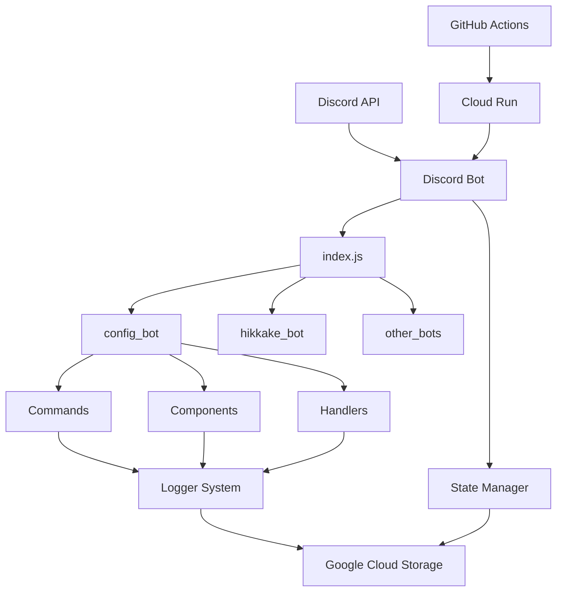

# SVML Discord Bot システム仕様書

> 最終更新: 2025年8月6日

## 📋 目次

1. [システム概要](#システム概要)
2. [アーキテクチャ](#アーキテクチャ)
3. [Bot モジュール仕様](#bot-モジュール仕様)
4. [ログシステム](#ログシステム)
5. [状態管理システム](#状態管理システム)
6. [ファイルシステム](#ファイルシステム)
7. [API仕様](#api仕様)
8. [データベース仕様](#データベース仕様)

---

## システム概要

### プロジェクト情報
- **プロジェクト名**: SVML Discord Bot
- **バージョン**: 2.0.0
- **言語**: Node.js (v20以上)
- **フレームワーク**: Discord.js v14
- **クラウド**: Google Cloud Platform
- **デプロイ**: Cloud Run + GitHub Actions

### 主要機能
1. **設定Bot (config_bot)** - サーバー設定管理
2. **ひっかけBot (hikkake_bot)** - ひっかけクイズシステム
3. **経費申請Bot (keihi_bot)** - 経費申請管理
4. **出退勤Bot (syuttaikin_bot)** - 勤怠管理
5. **売上報告Bot (uriage_bot)** - 売上データ管理
6. **レベルBot (level_bot)** - ユーザーレベルシステム

---

## アーキテクチャ

### システム構成図


### モジュール構造
```
svml_zimu_bot/
├── index.js                 # メインエントリーポイント
├── client.js               # Discord クライアント設定
├── healthcheck.js          # ヘルスチェック
├── events/                 # Discord イベント処理
│   ├── ready.js           # Bot起動時処理
│   ├── interactionCreate.js # インタラクション処理
│   ├── messageCreate.js   # メッセージ処理
│   └── devcmd.js          # 開発コマンド
├── common/                 # 共通モジュール
│   ├── logger.js          # ログシステム
│   ├── fileHelper.js      # ファイル操作
│   ├── stateManager.js    # 状態管理
│   ├── gcs/               # Google Cloud Storage
│   └── utils/             # ユーティリティ
├── config_bot/            # 設定Bot
├── hikkake_bot/           # ひっかけBot
└── [other_bots]/          # その他のBot
```

---

## Bot モジュール仕様

### 標準モジュール構造

#### index.js (各Bot共通)
```javascript
// Bot モジュールの標準実装
const fs = require('fs');
const path = require('path');
const logger = require('@root/common/logger');

// コマンド読み込み
const commandsPath = path.join(__dirname, 'commands');
const commands = [];

if (fs.existsSync(commandsPath)) {
  const commandFiles = fs.readdirSync(commandsPath).filter(file => file.endsWith('.js'));
  
  for (const file of commandFiles) {
    try {
      const command = require(path.join(commandsPath, file));
      if (command && command.data && command.execute) {
        commands.push(command);
      }
    } catch (error) {
      logger.error(`コマンド読み込みエラー [${file}]:`, error);
    }
  }
}

// コンポーネントハンドラー読み込み
const componentHandlers = [];
const handlersPath = path.join(__dirname, 'handlers');

if (fs.existsSync(handlersPath)) {
  const handlerFiles = fs.readdirSync(handlersPath).filter(file => file.endsWith('.js'));
  
  for (const file of handlerFiles) {
    try {
      const handler = require(path.join(handlersPath, file));
      if (handler && typeof handler.execute === 'function') {
        componentHandlers.push(handler);
      }
    } catch (error) {
      logger.error(`ハンドラー読み込みエラー [${file}]:`, error);
    }
  }
}

// モジュール統計
const moduleStats = {
  commands: commands.length,
  handlers: componentHandlers.length,
  loadTime: Date.now()
};

logger.info(`Bot モジュール読み込み完了:`, moduleStats);

// エクスポート
module.exports = {
  commands: commands.filter(cmd => cmd && cmd.data && cmd.execute),
  componentHandlers: componentHandlers.filter(handler => handler && typeof handler.execute === 'function'),
  metadata: {
    moduleName: path.basename(__dirname),
    version: '1.0.0',
    loadTime: moduleStats.loadTime,
    stats: moduleStats
  }
};
```

### コマンド仕様

#### SlashCommand 基本構造
```javascript
const { SlashCommandBuilder, PermissionFlagsBits } = require('discord.js');
const logger = require('@root/common/logger');

module.exports = {
  data: new SlashCommandBuilder()
    .setName('コマンド名')
    .setDescription('コマンドの説明')
    .setDefaultMemberPermissions(PermissionFlagsBits.Administrator),

  async execute(interaction) {
    const startTime = Date.now();
    
    try {
      // 権限チェック
      if (!interaction.member.permissions.has('Administrator')) {
        await interaction.reply({
          content: '❌ 管理者権限が必要です。',
          ephemeral: true
        });
        return;
      }

      // 処理の開始
      await interaction.deferReply({ ephemeral: false });

      // メイン処理
      const result = await processCommand(interaction);

      // 応答
      await interaction.editReply({
        content: result.message,
        embeds: result.embeds,
        components: result.components
      });

      // パフォーマンスログ
      const executionTime = Date.now() - startTime;
      logger.info(`コマンド実行完了 [${interaction.commandName}]: ${executionTime}ms`);

    } catch (error) {
      logger.error(`コマンドエラー [${interaction.commandName}]:`, error);

      // エラー応答
      try {
        const errorMessage = process.env.NODE_ENV === 'development' 
          ? `❌ エラー: ${error.message}`
          : '❌ 処理中にエラーが発生しました。';

        if (interaction.deferred) {
          await interaction.editReply({ content: errorMessage });
        } else {
          await interaction.reply({ content: errorMessage, ephemeral: true });
        }
      } catch (replyError) {
        logger.error('エラー応答失敗:', replyError);
      }
    }
  },
};
```

### コンポーネントハンドラー仕様

#### インタラクション処理
```javascript
const logger = require('@root/common/logger');

module.exports = {
  name: 'handlerName',
  
  async execute(interaction) {
    const startTime = Date.now();
    
    try {
      // customId解析
      const [action, ...params] = interaction.customId.split('_');
      
      logger.debug(`ハンドラー実行: ${action}`, { params });

      // アクション分岐
      switch (action) {
        case 'button1':
          await handleButton1(interaction, params);
          break;
        case 'select1':
          await handleSelect1(interaction, params);
          break;
        default:
          logger.warn(`未対応のアクション: ${action}`);
          await interaction.reply({
            content: '❌ 無効な操作です。',
            ephemeral: true
          });
      }

      // パフォーマンスログ
      const executionTime = Date.now() - startTime;
      logger.debug(`ハンドラー完了 [${action}]: ${executionTime}ms`);

    } catch (error) {
      logger.error(`ハンドラーエラー [${interaction.customId}]:`, error);

      // エラー応答
      try {
        if (!interaction.replied && !interaction.deferred) {
          await interaction.reply({
            content: '❌ 処理中にエラーが発生しました。',
            ephemeral: true
          });
        }
      } catch (replyError) {
        logger.error('エラー応答失敗:', replyError);
      }
    }
  }
};
```

---

## ログシステム

### ログ仕様

#### 基本設計
- **ログレベル**: ERROR, WARN, INFO, DEBUG
- **出力先**: ファイル + コンソール
- **フォーマット**: JSON構造化ログ
- **ローテーション**: 日次ローテーション
- **保持期間**: 30日間

#### Logger実装
```javascript
// common/logger.js
const winston = require('winston');
const path = require('path');

class Logger {
  constructor() {
    this.logger = winston.createLogger({
      level: process.env.LOG_LEVEL || 'info',
      format: winston.format.combine(
        winston.format.timestamp(),
        winston.format.errors({ stack: true }),
        winston.format.json()
      ),
      transports: [
        // ファイル出力
        new winston.transports.File({
          filename: path.join(__dirname, '../logs/error.log'),
          level: 'error',
          maxsize: 10 * 1024 * 1024, // 10MB
          maxFiles: 5
        }),
        new winston.transports.File({
          filename: path.join(__dirname, '../logs/combined.log'),
          maxsize: 10 * 1024 * 1024, // 10MB
          maxFiles: 5
        }),
        // コンソール出力
        new winston.transports.Console({
          format: winston.format.combine(
            winston.format.colorize(),
            winston.format.simple()
          )
        })
      ]
    });

    // プロダクション環境ではコンソール出力を無効化
    if (process.env.NODE_ENV === 'production') {
      this.logger.remove(this.logger.transports.find(t => t.name === 'console'));
    }
  }

  info(message, meta = {}) {
    this.logger.info(message, {
      ...meta,
      timestamp: new Date().toISOString(),
      source: this.getSource()
    });
  }

  warn(message, meta = {}) {
    this.logger.warn(message, {
      ...meta,
      timestamp: new Date().toISOString(),
      source: this.getSource()
    });
  }

  error(message, meta = {}) {
    this.logger.error(message, {
      ...meta,
      timestamp: new Date().toISOString(),
      source: this.getSource(),
      stack: meta instanceof Error ? meta.stack : undefined
    });
  }

  debug(message, meta = {}) {
    this.logger.debug(message, {
      ...meta,
      timestamp: new Date().toISOString(),
      source: this.getSource()
    });
  }

  // セキュリティログ
  security(message, meta = {}) {
    this.logger.error(message, {
      ...meta,
      level: 'SECURITY',
      timestamp: new Date().toISOString(),
      source: this.getSource()
    });
  }

  // 監査ログ
  audit(message, meta = {}) {
    this.logger.info(message, {
      ...meta,
      level: 'AUDIT',
      timestamp: new Date().toISOString(),
      source: this.getSource()
    });
  }

  getSource() {
    const stack = new Error().stack;
    const caller = stack.split('\n')[3];
    const match = caller.match(/at\s+(.*)\s+\((.*):(\d+):(\d+)\)/);
    
    if (match) {
      return {
        function: match[1],
        file: path.basename(match[2]),
        line: match[3]
      };
    }
    
    return { function: 'unknown', file: 'unknown', line: 'unknown' };
  }
}

module.exports = new Logger();
```

### ログカテゴリ

#### アプリケーションログ
```javascript
// 一般的な処理ログ
logger.info('Bot起動完了', { modules: loadedModules });
logger.info('コマンド実行', { command: 'setup', user: interaction.user.id });

// 警告ログ
logger.warn('API制限に近づいています', { remaining: apiLimit });
logger.warn('未知のイベント受信', { event: eventType });

// エラーログ
logger.error('データベース接続失敗', error);
logger.error('Discord API エラー', { code: error.code, message: error.message });
```

#### セキュリティログ
```javascript
// 認証関連
logger.security('認証失敗', { userId: user.id, ip: clientIP });
logger.security('権限昇格試行', { userId: user.id, requiredRole: 'admin' });

// データアクセス
logger.security('機密データアクセス', { file: 'user_data.csv', userId: user.id });
logger.security('設定変更', { setting: 'permissions', oldValue: old, newValue: new });
```

#### パフォーマンスログ
```javascript
// 実行時間測定
const startTime = Date.now();
// ... 処理 ...
const executionTime = Date.now() - startTime;

logger.info('処理完了', {
  operation: 'dataSync',
  executionTime: executionTime,
  recordCount: records.length
});
```

### ログ監視

#### 監視対象ログ
- **ERROR レベル**: 即座にアラート
- **SECURITY レベル**: セキュリティチームに通知
- **パフォーマンス**: 閾値超過時にアラート

#### アラート設定
```javascript
// ログベースのアラート
function checkLogAlerts() {
  // エラー率が5%を超えた場合
  const errorRate = getErrorRate();
  if (errorRate > 0.05) {
    sendAlert('高エラー率検出', { rate: errorRate });
  }

  // レスポンス時間が10秒を超えた場合
  const avgResponseTime = getAverageResponseTime();
  if (avgResponseTime > 10000) {
    sendAlert('レスポンス時間異常', { time: avgResponseTime });
  }
}
```

---

## 状態管理システム

### 状態管理仕様

#### 基本設計
- **ストレージ**: Google Cloud Storage
- **フォーマット**: JSON
- **スコープ**: ユーザー、ギルド、グローバル
- **キャッシュ**: メモリ内キャッシュ
- **永続化**: 非同期保存

#### StateManager実装
```javascript
// common/stateManager.js
const gcsUtils = require('./gcs/gcsUtils');
const logger = require('./logger');

class StateManager {
  constructor() {
    this.cache = new Map();
    this.pendingSaves = new Map();
    this.saveInterval = 30000; // 30秒間隔で保存
    
    this.startAutoSave();
  }

  // 状態の読み取り
  async getState(key, defaultValue = {}) {
    try {
      // キャッシュから取得
      if (this.cache.has(key)) {
        return this.cache.get(key);
      }

      // GCSから読み取り
      const fileName = `states/${key}.json`;
      
      if (await gcsUtils.fileExists(fileName)) {
        const data = await gcsUtils.downloadFile(fileName);
        const state = JSON.parse(data);
        
        // キャッシュに保存
        this.cache.set(key, state);
        
        return state;
      }

      // デフォルト値を返す
      this.cache.set(key, defaultValue);
      return defaultValue;

    } catch (error) {
      logger.error(`状態読み取りエラー [${key}]:`, error);
      return defaultValue;
    }
  }

  // 状態の保存
  async setState(key, value) {
    try {
      // キャッシュに保存
      this.cache.set(key, value);
      
      // 非同期保存をスケジュール
      this.pendingSaves.set(key, {
        value: value,
        timestamp: Date.now()
      });

      logger.debug(`状態保存スケジュール [${key}]`);

    } catch (error) {
      logger.error(`状態保存エラー [${key}]:`, error);
      throw error;
    }
  }

  // 即座に保存
  async saveState(key) {
    try {
      const state = this.cache.get(key);
      if (!state) return;

      const fileName = `states/${key}.json`;
      const data = JSON.stringify(state, null, 2);
      
      await gcsUtils.uploadFile(data, fileName);
      
      // 保存待ちから削除
      this.pendingSaves.delete(key);
      
      logger.debug(`状態保存完了 [${key}]`);

    } catch (error) {
      logger.error(`状態保存エラー [${key}]:`, error);
      throw error;
    }
  }

  // 自動保存
  startAutoSave() {
    setInterval(async () => {
      const pendingKeys = Array.from(this.pendingSaves.keys());
      
      for (const key of pendingKeys) {
        try {
          await this.saveState(key);
        } catch (error) {
          logger.error(`自動保存エラー [${key}]:`, error);
        }
      }
      
      if (pendingKeys.length > 0) {
        logger.debug(`自動保存完了: ${pendingKeys.length}件`);
      }
    }, this.saveInterval);
  }

  // 特定の状態を削除
  async deleteState(key) {
    try {
      // キャッシュから削除
      this.cache.delete(key);
      this.pendingSaves.delete(key);

      // GCSから削除
      const fileName = `states/${key}.json`;
      await gcsUtils.deleteFile(fileName);

      logger.info(`状態削除完了 [${key}]`);

    } catch (error) {
      logger.error(`状態削除エラー [${key}]:`, error);
      throw error;
    }
  }
}

module.exports = new StateManager();
```

### 専用状態管理

#### ユーザープロファイル
```javascript
// common/utils/userProfilesStateManager.js
const stateManager = require('../stateManager');

class UserProfilesStateManager {
  constructor() {
    this.stateKey = 'userProfiles';
  }

  async getUserProfile(userId) {
    const profiles = await stateManager.getState(this.stateKey, {});
    return profiles[userId] || {
      level: 1,
      xp: 0,
      settings: {},
      createdAt: new Date().toISOString()
    };
  }

  async updateUserProfile(userId, updates) {
    const profiles = await stateManager.getState(this.stateKey, {});
    
    profiles[userId] = {
      ...profiles[userId],
      ...updates,
      updatedAt: new Date().toISOString()
    };

    await stateManager.setState(this.stateKey, profiles);
  }

  async deleteUserProfile(userId) {
    const profiles = await stateManager.getState(this.stateKey, {});
    delete profiles[userId];
    await stateManager.setState(this.stateKey, profiles);
  }
}

module.exports = new UserProfilesStateManager();
```

---

## ファイルシステム

### ファイル操作

#### FileHelper実装
```javascript
// common/fileHelper.js
const fs = require('fs').promises;
const path = require('path');
const logger = require('./logger');

class FileHelper {
  constructor() {
    this.tempDir = path.join(__dirname, '../temp');
    this.dataDir = path.join(__dirname, '../data');
  }

  // ディレクトリ作成
  async ensureDir(dirPath) {
    try {
      await fs.mkdir(dirPath, { recursive: true });
    } catch (error) {
      if (error.code !== 'EEXIST') {
        logger.error('ディレクトリ作成エラー:', error);
        throw error;
      }
    }
  }

  // ファイル読み取り
  async readFile(filePath, encoding = 'utf8') {
    try {
      return await fs.readFile(filePath, encoding);
    } catch (error) {
      logger.error('ファイル読み取りエラー:', error);
      throw error;
    }
  }

  // ファイル書き込み
  async writeFile(filePath, data, encoding = 'utf8') {
    try {
      await this.ensureDir(path.dirname(filePath));
      await fs.writeFile(filePath, data, encoding);
    } catch (error) {
      logger.error('ファイル書き込みエラー:', error);
      throw error;
    }
  }

  // ファイル存在確認
  async fileExists(filePath) {
    try {
      await fs.access(filePath);
      return true;
    } catch {
      return false;
    }
  }

  // ファイル削除
  async deleteFile(filePath) {
    try {
      await fs.unlink(filePath);
    } catch (error) {
      if (error.code !== 'ENOENT') {
        logger.error('ファイル削除エラー:', error);
        throw error;
      }
    }
  }

  // 一時ファイル作成
  async createTempFile(data, extension = '.tmp') {
    const fileName = `temp_${Date.now()}_${Math.random().toString(36).substr(2, 9)}${extension}`;
    const filePath = path.join(this.tempDir, fileName);
    
    await this.writeFile(filePath, data);
    
    return filePath;
  }

  // 一時ファイル削除
  async cleanupTempFiles(maxAge = 3600000) { // 1時間
    try {
      await this.ensureDir(this.tempDir);
      const files = await fs.readdir(this.tempDir);
      
      for (const file of files) {
        const filePath = path.join(this.tempDir, file);
        const stats = await fs.stat(filePath);
        
        if (Date.now() - stats.mtime.getTime() > maxAge) {
          await this.deleteFile(filePath);
          logger.debug(`一時ファイル削除: ${file}`);
        }
      }
    } catch (error) {
      logger.error('一時ファイルクリーンアップエラー:', error);
    }
  }
}

module.exports = new FileHelper();
```

---

## API仕様

### Discord API ラッパー

#### Discord クライアント設定
```javascript
// client.js
const { Client, GatewayIntentBits, Partials } = require('discord.js');
const logger = require('./common/logger');

class DiscordClient {
  constructor() {
    this.client = new Client({
      intents: [
        GatewayIntentBits.Guilds,
        GatewayIntentBits.GuildMessages,
        GatewayIntentBits.GuildMembers,
        GatewayIntentBits.MessageContent,
      ],
      partials: [
        Partials.Message,
        Partials.Channel,
        Partials.Reaction,
      ],
    });

    this.setupEventHandlers();
  }

  setupEventHandlers() {
    this.client.on('ready', () => {
      logger.info(`Bot起動完了: ${this.client.user.tag}`);
    });

    this.client.on('error', (error) => {
      logger.error('Discord クライアントエラー:', error);
    });

    this.client.on('warn', (warning) => {
      logger.warn('Discord クライアント警告:', warning);
    });
  }

  async login(token) {
    try {
      await this.client.login(token);
      logger.info('Discord ログイン成功');
    } catch (error) {
      logger.error('Discord ログインエラー:', error);
      throw error;
    }
  }

  getClient() {
    return this.client;
  }
}

module.exports = new DiscordClient();
```

### HTTP API

#### ヘルスチェック API
```javascript
// healthcheck.js
const express = require('express');
const logger = require('./common/logger');

class HealthCheckServer {
  constructor() {
    this.app = express();
    this.setupRoutes();
  }

  setupRoutes() {
    // 基本ヘルスチェック
    this.app.get('/', (req, res) => {
      res.status(200).json({
        status: 'OK',
        timestamp: new Date().toISOString(),
        uptime: process.uptime()
      });
    });

    // 詳細ヘルスチェック
    this.app.get('/health', (req, res) => {
      const health = {
        status: 'healthy',
        timestamp: new Date().toISOString(),
        uptime: process.uptime(),
        memory: process.memoryUsage(),
        pid: process.pid,
        version: process.version,
        environment: process.env.NODE_ENV || 'development'
      };

      res.status(200).json(health);
    });

    // メトリクス
    this.app.get('/metrics', (req, res) => {
      const metrics = {
        timestamp: new Date().toISOString(),
        process: {
          uptime: process.uptime(),
          memory: process.memoryUsage(),
          cpu: process.cpuUsage()
        },
        system: {
          platform: process.platform,
          arch: process.arch,
          nodeVersion: process.version
        }
      };

      res.status(200).json(metrics);
    });
  }

  start(port = 8080) {
    this.server = this.app.listen(port, () => {
      logger.info(`ヘルスチェックサーバー起動: ポート ${port}`);
    });
  }

  stop() {
    if (this.server) {
      this.server.close(() => {
        logger.info('ヘルスチェックサーバー停止');
      });
    }
  }
}

module.exports = new HealthCheckServer();
```

---

## データベース仕様

### データ構造

#### ユーザープロファイル
```json
{
  "userId": "123456789012345678",
  "profile": {
    "level": 5,
    "xp": 1250,
    "settings": {
      "notifications": true,
      "privacy": "public"
    },
    "stats": {
      "commandsUsed": 42,
      "messagesCount": 1337
    },
    "createdAt": "2023-01-01T00:00:00.000Z",
    "updatedAt": "2023-12-31T23:59:59.999Z"
  }
}
```

#### ギルド設定
```json
{
  "guildId": "123456789012345678",
  "settings": {
    "prefix": "!",
    "welcomeChannel": "987654321098765432",
    "modRole": "876543210987654321",
    "features": {
      "leveling": true,
      "welcome": false,
      "moderation": true
    },
    "permissions": {
      "adminRoles": ["876543210987654321"],
      "modRoles": ["765432109876543210"]
    }
  },
  "createdAt": "2023-01-01T00:00:00.000Z",
  "updatedAt": "2023-12-31T23:59:59.999Z"
}
```

#### アプリケーション状態
```json
{
  "botStats": {
    "uptime": 86400,
    "commandsExecuted": 1000,
    "errorsCount": 5,
    "lastRestart": "2023-12-31T00:00:00.000Z"
  },
  "systemHealth": {
    "memoryUsage": "45%",
    "cpuUsage": "12%",
    "diskUsage": "67%"
  }
}
```

---

## パフォーマンス仕様

### 応答時間目標
- **コマンド応答**: 2秒以内
- **API呼び出し**: 1秒以内
- **データ読み書き**: 3秒以内

### リソース制限
- **メモリ使用量**: 512MB以下
- **CPU使用量**: 1vCPU以下
- **ディスク使用量**: 1GB以下

### 監視メトリクス
- **エラー率**: 1%以下
- **可用性**: 99.9%以上
- **レスポンス時間**: 95%ile 5秒以下

---

*この仕様書は継続的に更新されます。技術的な詳細について質問があれば開発チームに相談してください。*
